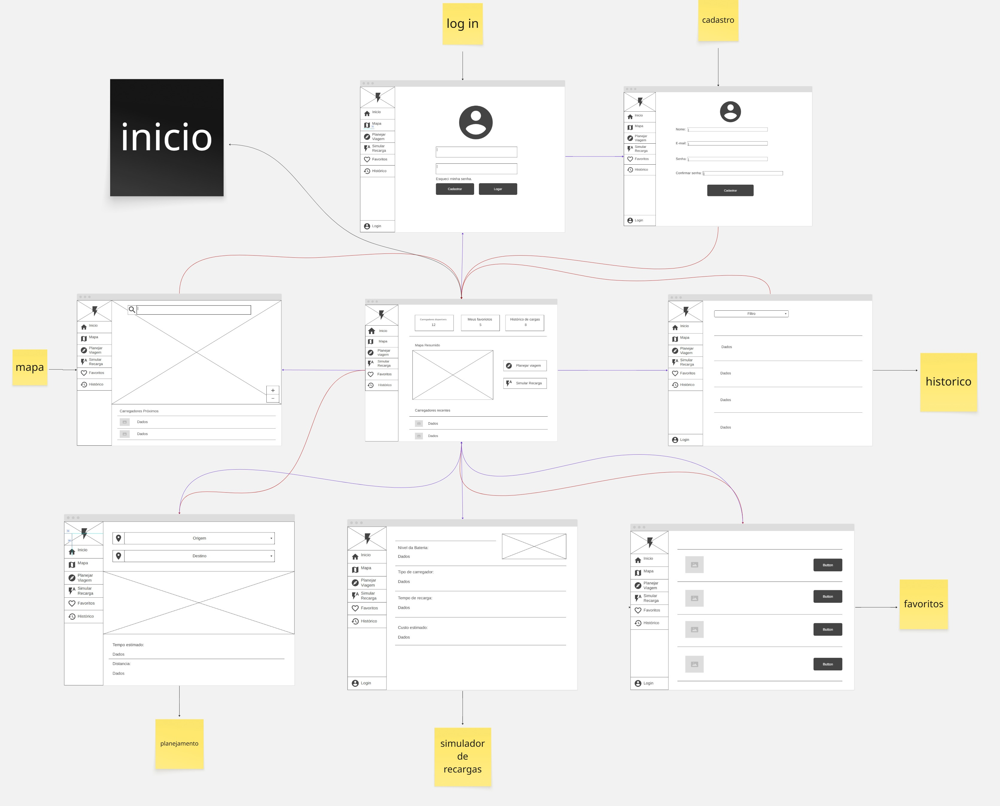
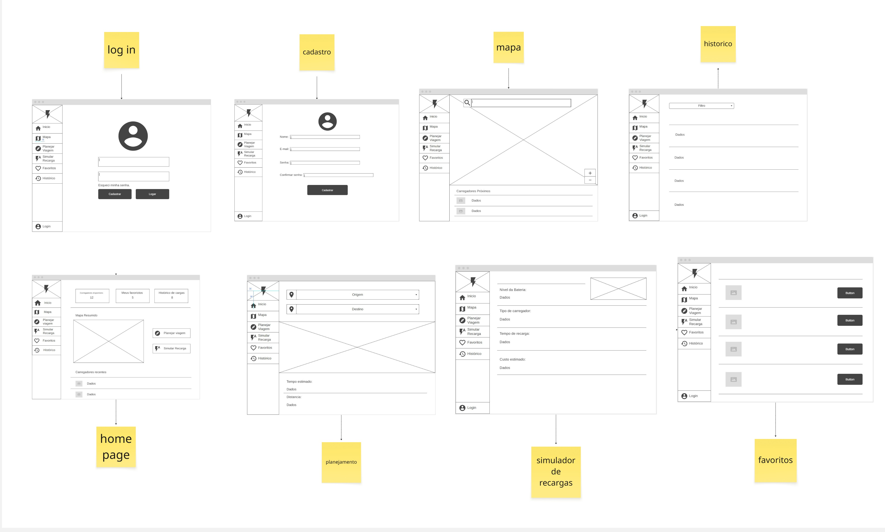
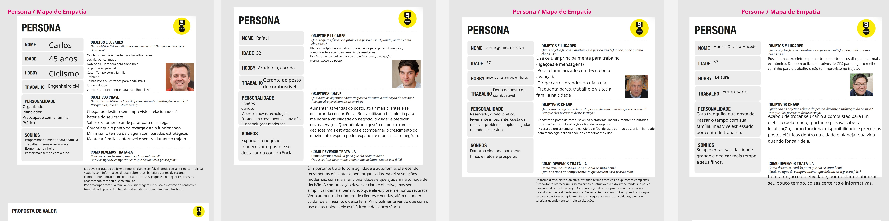

# Nome do projeto
ChargerMaps

O objetivo do ChargerMaps é o de indicar a melhor rota com postos eletricos e simular os gastos para o cliente que deseja viajar, para que o mesmo não tenha supresas inesperadas durante o trajeto.

## Alunos integrantes da equipe

* Brendon Leonardo Martins Alves
* Crispim Bruno da Silva Junior
* Gabriel do Carmo Assis
* João Paulo Ferreira Rodrigues
* Marcelo Artur Soares Sartori
* Matheus Possemato Lopes

## Professores responsáveis

* Caroline Rhaian da Silva Jandre
* Danilo de Quadros Maia Filho
* Diego Augusto de Faria Barros

## Contexto do projeto
- Problema

Muitos usuarios de carros eletricos não tem noção dos postos elétricos dísponiveis na sua região e tem receio de viajar com seus veículos, pela falta de postos pela estrada. Além disso, diversos postos gostariam de ter a oportunidade de divulgar suas localizações e bombas elétricas para os motoristas, e assim aumentarem seus lucros.

- Objetivo

O objetivo é desenvolver um site que possibilite o condutor ter acesso aos postos e os postos teresm uma maior visibilidade.
- Objetivo específico

* permitir o usuario conhecer os postos de sua região
* simular o tempo gasto com o abastecimento
* planejar rotas de viagem

- justificativa

Muitos motoristas se sentem inseguros em viagens, por conta dos vários postos na estrada que não fornecem  carga a carros elétricos. O site vai guiar esses motoristas e dar-lhes confiança de que sua viagem não terá contratempos com o 'combustível'.
Poder simular o tempo aproximado gasto com as recargas, permite o motorista planejar melhor sua rota e paradas e, junto ao planejador de rotas, ter uma melhor experiência de viajem.

- Público alvo

O publico alvo são todos os motoristas de carro elétrico com conhecimento básico em utilização de sites, de todas as classes hierarquicas do ramo, seja futuro cliente, cliente fiel ou dono.

## Processo de Product Discovery

- Matriz CSD e mapa stakeholders

- Pesquisa e entendimento do problema

- Personas

## Processo de Product Design

- Histórias de usuários

- Proposta de Valor

- Projeto de Interface

- UserFlow

- Wireframes

- Protótipo Interativo

https://inside-sleet-45413344.figma.site

## Metodologia

- Ferramentas

whatsapp - comunicação
Discord - comunicação
Google - Pesquisa 
Miro - diagramação
VS code - editor de cóodigo 
Figma - diagramação

- Organização da equipe e divisão de papéis

Brendon Leonardo = Desenvolvimento
Crispim Bruno = Product Owner
Gabriel do Carmo = Scrum Master
João Paulo - Desenvolvimento
Marcelo Artur - Desenvolvimento
Matheus Possemato - Desenvolvimento

Crispim foi designado para entrega dos trabalhos e realização de atividades como documentação, além de coordernar o ritmo e tomada de decisão do que ser feito no projeto e projetar o mapa / Editor de perfil.

Gabriel foi designado a verificar o funcionamento do site e concertar erros que possam interferir em outras partes, fora a própria de projetar o planejador de viajens e a página postos (adm).

João foi designado para auxilio nas tomadas de decisão e controle do pessoal, além da manutenção do site e o projeto da aba favoritos.

Marcelo foi designado a projetar o cadastro do site.
Matheus foi designado a projetar o simulador de viajens.
Brendon foi designado a projetar o historico do usuário.

- Quadro de controle de tarefas (Kanban)

# Solução implementada

## Favoritos

### Funcionalidade 1 - Listagem de postos favoritos do usuário logado 

 Exibe os postos de recarga que o usuário atualmente autenticado marcou como favoritos. A lista é personalizada por usuário: o módulo identifica quem está logado a partir da sessão (sessionStorage) e exibe apenas os favoritos vinculados àquele usuário. Quando não há ninguém logado, nenhum favorito é exibido e a página orienta o usuário a efetuar login. 

 Justificativa: é a funcionalidade central do módulo. Garante que cada usuário veja somente os seus próprios postos favoritos, atendendo ao requisito de personalização e privacidade dos dados de cada conta. 

 Estrutura de dados: Favoritos, Postos, Usuário Atual 

 Instruções de acesso:  

 -Abrir o site e efetuar o login 
 -No menu lateral, escolher a opção Favoritos 
 -A página carrega automaticamente os postos favoritos do usuário logado 

### Funcionalidade 2 - Adicionar posto aos favoritos 

 Permite que o usuário logado adicione um posto à sua lista de favoritos. Ao acionar a ação, é exibido um modal contendo apenas os postos que ainda não fazem parte da lista de favoritos do usuário, evitando duplicidade. 

 Justificativa: dá ao usuário autonomia para montar a própria lista de postos de interesse, sem depender de cadastro manual em banco de dados. 

Estrutura de dados: Favoritos, Postos 

 Instruções de acesso:  

 -Na página de Favoritos, clicar no botão Adicionar favorito 
 -Escolher o posto desejado na lista do modal 
 -Clicar em Adicionar; o posto passa a aparecer na lista de favoritos 

### Funcionalidade 3 - Remover posto dos favoritos 

 Permite que o usuário logado retire um posto da sua lista de favoritos. A alteração é persistida no servidor. 

 Justificativa: complementa a funcionalidade de adição, permitindo que o usuário mantenha a lista atualizada conforme seus interesses mudam. 

 Estrutura de dados: Favoritos 

 Instruções de acesso:  

 -Na página de Favoritos, localizar o card do posto desejado 
 -Clique no botão Remover do card 

### Funcionalidade 4 - Pesquisa e filtro de favoritos 

 Permite localizar postos dentro da lista de favoritos por meio de uma barra de pesquisa (que considera nome, endereço e cidade) e de filtros por status de operação (Todos, Disponível, Ocupada, Fora de serviço). 

 Justificativa: melhora a usabilidade quando o usuário possui muitos postos favoritados, permitindo encontrar rapidamente o posto desejado. 

 Estrutura de dados: Postos 

 Instruções de acesso:  

 -Na página de Favoritos, digitar um termo na barra de pesquisa, ou 
 -Clicar em um dos botões de filtro de status na barra de ações 

### Funcionalidade 5 - Visualização de detalhes do posto 

 Exibe uma página com os dados completos de um posto favoritado, incluindo endereço, telefone, horário de funcionamento e, quando aplicável, as informações do ponto de recarga elétrica (conector, potência e número de tomadas). 

 Justificativa: concentra em uma única tela todas as informações necessárias para o usuário decidir se vai utilizar aquele posto. 

 Estrutura de dados: Postos 

 Instruções de acesso:  

 -Na página de Favoritos, no card do posto desejado, clicar em Ver detalhes 

## Postos: 

### Funcionalidade 1 - Listagem de Postos de Recarga 

Exibe em cards todos os postos de recarga cadastrados no sistema. Cada card apresenta a imagem, nome, endereço, cidade e telefone do posto. A lista é carregada dinamicamente a partir do servidor REST ao abrir a página. 

Justificativa: É a funcionalidade central do módulo de postos. Permite que administradores visualizem rapidamente todos os pontos de recarga cadastrados, servindo de ponto de partida para edição e exclusão. 

Estrutura de dados: Postos 

Instruções de acesso: 

- Acessar a página postos.html 
- Os cards dos postos são renderizados automaticamente ao carregar a página 

### Funcionalidade 2 - Cadastrar Novo Posto 

Permite registrar um novo posto de recarga no sistema. O formulário solicita nome, endereço, cidade, telefone, horário de funcionamento e URL de imagem. Ao salvar, as coordenadas geográficas (latitude e longitude) são obtidas automaticamente via API de geocodificação (Nominatim/OpenStreetMap) a partir do endereço e cidade informados. 

Justificativa: Centraliza o cadastro de novos pontos de recarga, garantindo que as coordenadas geográficas sejam sempre preenchidas de forma automática e consistente, sem exigir que o administrador informe latitude e longitude manualmente. 
 
Estrutura de dados: Postos 

Instruções de acesso: 

-Na página postos.html, clicar em Adicionar posto 
-Preencher todos os campos do formulário na página editPosto.html 
-Clicar em Salvar Posto; o sistema geocodifica o endereço e persiste o registro 
-O usuário é redirecionado de volta para postos.html 

### Funcionalidade 3 - Editar Posto Existente 

Permite alterar os dados de um posto já cadastrado. Ao acessar a tela de edição, os campos são preenchidos automaticamente com as informações atuais do posto. Após a alteração, as coordenadas geográficas são recalculadas com base no endereço e cidade atualizados. 

Justificativa: Garante que os dados dos postos permaneçam atualizados, inclusive as coordenadas geográficas usadas pelo mapa e pelo planejador de viagem para exibir os marcadores corretamente. 

Estrutura de dados: Postos 

Instruções de acesso: 

-Na página postos.html, no card do posto desejado, clicar em Editar 
-Alterar os campos necessários na página editPosto.html 
-Clicar em Atualizar Posto para salvar as alterações 

### Funcionalidade 4 - Excluir Posto 

Permite remover permanentemente um posto do sistema. Antes de efetivar a exclusão, o sistema exibe uma caixa de confirmação para evitar exclusões acidentais. 

Justificativa: Oferece ao administrador o controle completo sobre o catálogo de postos, permitindo remover registros desatualizados ou incorretos. 

Estrutura de dados: Postos 

Instruções de acesso: 

-Na página postos.html, no card do posto desejado, clicar em Deletar 
-Confirmar a exclusão na caixa de diálogo exibida 
-A página é recarregada e o posto não aparece mais na listagem 

## Planejador: 

### Funcionalidade 1 - Calcular Rota entre Dois Endereços 

Permite ao usuário informar um endereço de saída e um de destino em texto livre. O sistema geocodifica ambos os endereços via Nominatim (OpenStreetMap) e consulta a API OpenRouteService para obter a rota de carro mais adequada, que é então desenhada no mapa interativo (Leaflet). 

Justificativa: É a funcionalidade principal do planejador. Transforma endereços em texto (sem necessidade de coordenadas manuais) em uma rota visual no mapa, reduzindo a fricção para o usuário que deseja planejar uma viagem de veículo elétrico. 

Estrutura de dados: Postos (para exibição dos marcadores no mapa) 

Instruções de acesso: 

-Acessar a página planejador.html 
-Digitar o endereço de saída no primeiro campo 
-Digitar o endereço de destino no segundo campo 
-Clicar em Calcular; a rota é exibida no mapa 

### Funcionalidade 2 - Exibir Tempo e Distância Estimados da Viagem 

Após o cálculo da rota, exibe o tempo estimado de viagem (em horas e minutos) e a distância total em quilômetros. Os dados são extraídos diretamente da resposta da API OpenRouteService e apresentados na seção de resultados abaixo do mapa. 

Justificativa: Fornece ao usuário informações essenciais para planejar a viagem, como o tempo necessário e o consumo esperado de bateria, sem precisar consultar outro aplicativo. 

Estrutura de dados: Nenhuma (dados retornados diretamente pela API de rota) 

Instruções de acesso: 

-Calcular uma rota conforme a Funcionalidade 5 
-Os valores de tempo e distância são exibidos automaticamente na seção de resultados 

### Funcionalidade 3 - Contagem de Postos no Trajeto 

Identifica e contabiliza os postos de recarga cadastrados que estão a até 500 metros de algum ponto da rota calculada. A contagem é exibida na seção de resultados como "Postos no caminho". 

Justificativa: Permite ao usuário saber quantas opções de recarga existem ao longo do trajeto planejado, facilitando a decisão de quando e onde parar para carregar o veículo elétrico. 

Estrutura de dados: Postos 

Instruções de acesso: 

-Calcular uma rota conforme a Funcionalidade 5 
-O número de postos próximos à rota é exibido automaticamente na seção de resultados 

### Funcionalidade 4 - Mapa Interativo com Marcadores de Postos 

Exibe um mapa interativo (Leaflet + OpenStreetMap) com marcadores em todos os postos cadastrados que possuem coordenadas válidas. Ao clicar em um marcador, é exibido um popup com o nome e o tipo de conector do posto. A rota calculada é sobreposta ao mapa como uma camada GeoJSON. 

Justificativa: Oferece uma visão espacial de todos os pontos de recarga disponíveis, ajudando o usuário a identificar postos próximos à rota e planejar paradas estratégicas. 

Estrutura de dados: Postos 

Instruções de acesso: 

-Acessar a página planejador.html; os marcadores são carregados automaticamente 
-Clicar em qualquer marcador para ver o nome e o tipo de conector do posto 
-Calcular uma rota para visualizá-la sobreposta aos marcadores 

## Mapa 

### Funcionalidade 1 - Exibição dos postos no mapa 

Carrega todos os postos de recarga cadastrados via requisição GET /postos e os exibe como marcadores interativos no mapa Leaflet. Ao clicar em um marcador, um popup é exibido com o nome e o tipo de conector do posto. 

Justificativa: é a funcionalidade central do módulo. Permite que o usuário visualize todos os pontos de recarga disponíveis em Belo Horizonte e região sobre um mapa interativo. 

Estrutura de dados: Postos 

Instruções de acesso: 

-Abrir a página mapa.html 
-Os marcadores são renderizados automaticamente ao carregar a página 
-Clicar em qualquer marcador exibe o popup com nome e tipo de conector 

### Funcionalidade 2 - Lista de postos próximos 

Além do mapa, a página exibe uma lista lateral com cards de todos os postos carregados, contendo nome, endereço, tipo de conector, potência, horário e status de operação. Ao clicar em um card, o mapa centraliza no posto correspondente e abre o popup do marcador. 

Justificativa: complementa o mapa com uma visão em lista, facilitando a leitura dos dados de cada posto sem precisar interagir com os marcadores. 

Estrutura de dados: Postos 

Instruções de acesso: 

-Na página mapa.html, a lista é exibida na seção lateral 
-Clicar em um card centraliza o mapa no posto e abre o popup 

### Funcionalidade 3 - Localização do usuário (GPS) 

Detecta a posição atual do usuário via API de Geolocalização do navegador (getCurrentPosition) e exibe um marcador azul estilo GPS no mapa. A posição é atualizada automaticamente ao iniciar o acompanhamento de rota. 

Justificativa: permite que o usuário saiba onde está em relação aos postos exibidos, servindo de ponto de partida para o traçado de rotas. 

Estrutura de dados: nenhuma (dado obtido diretamente do navegador) 

Instruções de acesso: 

-Ao abrir mapa.html, o navegador solicita permissão de localização 
-Ao conceder, o marcador azul é exibido na posição atual 

### Funcionalidade 4 - Traçar rota até o posto 

Ao clicar em um card de posto, se a localização do usuário estiver disponível, uma rota é calculada automaticamente entre a posição atual e o posto selecionado usando o serviço OSRM (routing.openstreetmap.de). A rota é exibida no mapa com linha azul. Caso já exista uma rota ativa, ela é removida antes de traçar a nova. 

Justificativa: oferece ao usuário navegação direta até o posto escolhido, sem precisar sair da aplicação. 

Estrutura de dados: Postos 

Instruções de acesso: 

-Conceder permissão de localização 
-Clicar em um card de posto na lista lateral 
-A rota é traçada automaticamente entre o usuário e o posto 

### Funcionalidade 5 - Acompanhamento em tempo real 

Após iniciar uma rota, a posição do usuário é monitorada continuamente via watchPosition. O waypoint de origem da rota é atualizado a cada nova posição recebida, mantendo a navegação ativa. 

Justificativa: garante que a rota reflita a posição real do usuário enquanto ele se desloca, sem precisar recalcular manualmente. 

Estrutura de dados: nenhuma (dado obtido diretamente do navegador) 

Instruções de acesso: 

-O acompanhamento inicia automaticamente ao traçar uma rota 
-A posição no mapa é atualizada a cada deslocamento detectado 

### Funcionalidade 6 - Encerrar rota 

Um botão flutuante 'Encerrar rota' é criado dinamicamente ao iniciar o acompanhamento. Ao clicar, a rota é removida do mapa, o watchPosition é cancelado e o botão é destruído. 

Justificativa: dá ao usuário controle para encerrar a navegação ativa quando desejar. 

Estrutura de dados: nenhuma 

Instruções de acesso: 

-Com uma rota ativa, clicar no botão vermelho 'Encerrar rota' na base da tela 

## Perfil 

### Funcionalidade 1 - Visualização dos dados do perfil 

Ao carregar a página, os dados do usuário logado são lidos do sessionStorage (chave usuarioCorrente) e preenchidos nos campos do formulário em modo somente leitura. Caso não exista sessão ativa, o usuário é redirecionado para login.html. 

Justificativa: permite ao usuário consultar suas informações cadastradas sem risco de alteração acidental. 

Estrutura de dados: Usuário Corrente 

Instruções de acesso: 

-Efetuar login na aplicação 
-Navegar para perfil.html 
-Os campos são preenchidos automaticamente com os dados da sessão 

### Funcionalidade 2 - Edição dos dados do perfil 

O botão 'Editar dados' habilita os campos de nome, e-mail e senha para edição. Os botões 'Salvar alterações' e 'Cancelar' são exibidos. O campo login permanece desabilitado em todos os modos. 

Justificativa: permite ao usuário manter seus dados atualizados de forma controlada, sem expor o campo de login a alterações. 

Estrutura de dados: Usuário Corrente 

Instruções de acesso: 

-Na página perfil.html, clicar em Editar dados 
-Alterar os campos desejados 
-Clicar em Salvar alterações ou Cancelar para descartar 

### Funcionalidade 3 - Verificação por código antes de salvar 

Ao submeter o formulário de edição, um modal de confirmação é exibido simulando o envio de um código de 4 dígitos para o e-mail do usuário. O e-mail é exibido parcialmente mascarado. O código válido na simulação é 0000. 

Justificativa: adiciona uma camada de segurança antes de persistir alterações nos dados da conta, evitando mudanças acidentais ou não autorizadas. 

Estrutura de dados: Usuário Corrente 

Instruções de acesso: 

-Após editar os campos, clicar em Salvar alterações 
-Digitar o código 0000 no modal exibido 
-Clicar em Confirmar 

### Funcionalidade 4 - Persistência das alterações 

Após validação do código, os dados atualizados (nome, e-mail e senha) são enviados ao servidor via PATCH /usuarios/:id. O sessionStorage é atualizado com o objeto retornado pela API. O formulário retorna ao modo de visualização e uma mensagem de sucesso é exibida. 

Justificativa: garante que as alterações sejam salvas tanto no servidor quanto na sessão ativa, mantendo consistência entre os dados exibidos e os armazenados. 

Estrutura de dados: Usuário Corrente, Usuários 

Instruções de acesso: 

-Confirmar o código no modal de verificação 
-A mensagem 'Dados atualizados com sucesso!' é exibida ao concluir 

### Funcionalidade 5 - Logout 

O botão 'Sair' na barra lateral encerra a sessão gravando { login: false } no sessionStorage e redireciona o usuário para a página do mapa. 

Justificativa: permite ao usuário encerrar a sessão de forma segura a partir de qualquer página que contenha a sidebar. 

Estrutura de dados: Usuário Corrente 

Instruções de acesso: 

-Na barra lateral, clicar em Sair

## Estrutura de dados

### Estrutura de Dados - Favoritos 

Armazena a relação entre cada usuário e os postos que ele marcou como favoritos. Cada registro associa um usuário (usuarioId) a uma lista de identificadores de postos (postosFavoritos). Os identificadores de posto são guardados como texto, pois um posto pode ter id numérico ("1") ou alfanumérico ("nQFOWm2C1io"); por isso, as comparações no código são sempre feitas convertendo os valores para string. 

{ 
  "id": "1", 
  "usuarioId": 1, 
  "nomeUsuario": "Lucas", 
  "postosFavoritos": ["6", "8", "7", "2", "1"] 
} 

 

### Estrutura de Dados - Postos 

Representa os postos de recarga apresentados na aplicação. É a fonte dos dados exibidos nos cards e na tela de detalhes. O campo status assume os valores disponivel, ocupada ou fora-de-servico, e o campo recarga indica se o posto possui ponto de recarga elétrica. 

{ 
  "id": "1", 
  "nome": "Posto Shell Select", 
  "endereco": "Av. Afonso Pena, 1500", 
  "cidade": "Belo Horizonte - MG", 
  "telefone": "(31) 3222-1100", 
  "horario": "24 horas", 
  "recarga": true, 
  "tipoConector": "Tipo 2 / CCS", 
  "potencia": "50 kW", 
  "tomadas": 2, 
  "status": "disponivel", 
  "imagem": "https://images.unsplash.com/photo-1585740452884-2a29a1d21514?w=120&h=120&fit=crop&auto=format", 
  "latitude": -19.9256585, 
  "longitude": -43.9349312 
} 

 

### Estrutura de Dados - Usuário Corrente (configuração de sessão) 

Estrutura de configuração mantida no sessionStorage do navegador, na chave usuarioCorrente. É gravada pelo módulo de login e consumida pela página de Favoritos para identificar quem está autenticado. O campo id é usado para localizar o registro de favoritos correspondente. Quando não há ninguém logado, a estrutura fica vazia ({}) ou com login igual a false. 

{ 
  "id": "1", 
  "login": "admin", 
  "email": "admin@abc.com", 
  "nome": "Administrador do Sistema", 
  "admin": true 
}

## Módulos e APIs 

### Linguagem e bibliotecas: 

-JavaScript (ECMAScript), sem framework de front-end 
-HTML5 e CSS3 para estrutura e estilização das telas 

### Módulos e APIs do navegador: 

-Fetch API — comunicação com o servidor REST (requisições GET e PATCH) 
-Web Storage API (sessionStorage) — leitura do usuário autenticado na sessão 
-URLSearchParams — leitura do identificador do posto na tela de detalhes 

### Módulos da aplicação: 

-login.js — módulo de autenticação e registro de usuários (fornecido na disciplina), responsável por gravar o usuarioCorrente no sessionStorage 
-userLogado.js — controla o estado de login exibido na barra lateral e o logout 
-postos.js — renderiza a listagem de postos e gerencia exclusão 
-editPosto.js — gerencia cadastro e edição de postos, incluindo geocodificação automática 
-planejadorScript.js — geocodifica endereços, consome a API de rotas e contabiliza postos no trajeto 

### Backend / API de dados: 

-json-server — servidor REST que disponibiliza os dados a partir do arquivo db.json. Endpoints consumidos pelo módulo de Favoritos:  

-GET /postos — lista todos os postos 
-GET /postos/:id — busca um posto específico (tela de detalhes) 
-GET /favoritos — lista os registros de favoritos 
-PATCH /favoritos/:id — atualiza a lista de postos favoritos de um usuário (adicionar/remover)
-POST /postos — cria um novo posto 
-PATCH /postos/:id — atualiza dados de um posto 
-DELETE /postos/:id — remove um posto 

-Unsplash — https://unsplash.com/ — imagens ilustrativas dos postos 

#### API's externas:

-Nominatim (OpenStreetMap) — geocodificação de endereços em texto para coordenadas geográficas 
-OpenRouteService — cálculo de rotas de carro retornando GeoJSON com distância e tempo estimados 
-Leaflet.js — biblioteca de mapas interativos usada para renderizar o mapa e os marcadores
-OSRM (routing.openstreetmap.de) — motor de roteamento para cálculo de trajetos de carro 

### Referencias Bibliográficas

https://trello.com

https://www.figma.com

https://miro.com

https://www.portalsolar.com.br/noticias/tecnologia/mobilidade-eletrica/25-dos-municipios-do-brasil-tem-postos-de-recarga-de-carros-eletricos

https://g1.globo.com/carros/noticia/2026/01/07/vendas-de-eletricos-e-hibridos-sobem-26percent-em-2025.ghtml

UNSPLASH. Unsplash. Disponível em: https://unsplash.com/. Acesso em: 25 jun. 2026. 

OPENSTREETMAP CONTRIBUTORS. Nominatim. Disponível em: https://nominatim.openstreetmap.org/. Acesso em: 26 jun. 2026. 

OPENROUTESERVICE. OpenRouteService API. Disponível em: https://openrouteservice.org/. Acesso em: 26 jun. 2026. 

LEAFLET. Leaflet — an open-source JavaScript library for mobile-friendly interactive maps. Disponível em: https://leafletjs.com/. Acesso em: 26 jun. 2026. 

MDN WEB DOCS. Geolocation API. Disponível em: https://developer.mozilla.org/en-US/docs/Web/API/Geolocation_API. Acesso em: 26 jun. 2026. 

MDN WEB DOCS. Web Storage API. Disponível em: https://developer.mozilla.org/en-US/docs/Web/API/Web_Storage_API. Acesso em: 26 jun. 2026. 

JSON SERVER. Disponível em: https://github.com/typicode/json-server. Acesso em: 26 jun. 2026. 