# Introdução

O crescimento da utilização de veículos elétricos no Brasil e no mundo evidencia a necessidade de ampliar a infraestrutura de recarga e facilitar o acesso às informações sobre os pontos disponíveis. Apesar do aumento no número de postos de recarga, muitos motoristas ainda encontram dificuldades para localizá-los, planejar viagens e estimar o tempo necessário para recarregar seus veículos, o que pode gerar insegurança durante deslocamentos, principalmente em trajetos mais longos.

Diante desse cenário, foi desenvolvido o E-charge, uma aplicação web voltada ao auxílio de usuários de veículos elétricos no planejamento de suas viagens e na localização de postos de recarga. A plataforma reúne funcionalidades como visualização de postos em mapa interativo, sistema de favoritos, planejamento de rotas, simulador de tempo de recarga, histórico de atividades e gerenciamento de perfil do usuário, proporcionando uma experiência mais prática e organizada.

Informações básicas do projeto.

* **Projeto:** 
E-charge

* **Repositório GitHub:** 
https://github.com/ICEI-PUC-Minas-PMGES-TI/pmg-es-2026-1-ti1-0427200-ideal-2

* **Membros da equipe:**

  * https://github.com/Gabriel-Assis26
  * https://github.com/CrispimBruno
  * https://github.com/celin6996
  * https://github.com/MatheusPossemato
  * https://github.com/joaopauloferreirarodrigues
  * https://github.com/BrendonLeonardo

A documentação do projeto é estruturada da seguinte forma:

1. Introdução
2. Contexto
3. Product Discovery
4. Product Design
5. Metodologia
6. Solução
7. Referências Bibliográficas

✅ [Documentação de Design Thinking (MIRO)](files/processo-dt.pdf)

# Contexto

Detalhes sobre o espaço de problema, os objetivos do projeto, sua justificativa e público-alvo.

## Problema

Muitos usuarios de carros eletricos não tem noção dos postos elétricos dísponiveis na sua região e tem receio de viajar com seus veículos, pela falta de postos pela estrada. Além disso, diversos postos gostariam de ter a oportunidade de divulgar suas localizações e bombas elétricas para os motoristas, e assim aumentarem seus lucros.

## Objetivos

O objetivo é desenvolver um site que possibilite o condutor ter acesso aos postos e os postos teresm uma maior visibilidade.
- Objetivo específico

* permitir o usuario conhecer os postos de sua região
* simular o tempo gasto com o abastecimento
* planejar rotas de viagem

## Justificativa

Muitos motoristas se sentem inseguros em viagens, por conta dos vários postos na estrada que não fornecem  carga a carros elétricos. O site vai guiar esses motoristas e dar-lhes confiança de que sua viagem não terá contratempos com o 'combustível'.
Poder simular o tempo aproximado gasto com as recargas, permite o motorista planejar melhor sua rota e paradas e, junto ao planejador de rotas, ter uma melhor experiência de viajem.

### Público alvo

O publico alvo são todos os motoristas de carro elétrico com conhecimento básico em utilização de sites, de todas as classes hierarquicas do ramo, seja futuro cliente, cliente fiel ou dono.

# Product Discovery

## Etapa de Entendimento

- Matriz CSD e mapa stakeholders

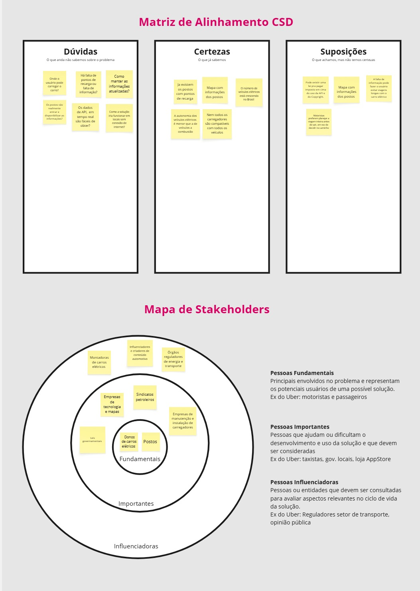

- Pesquisa e entendimento do problema

## Etapa de Definição

### Personas

# Product Design

Nesse momento, vamos transformar os insights e validações obtidos em soluções tangíveis e utilizáveis. Essa fase envolve a definição de uma proposta de valor, detalhando a prioridade de cada ideia e a consequente criação de wireframes, mockups e protótipos de alta fidelidade, que detalham a interface e a experiência do usuário.

## Histórias de Usuários

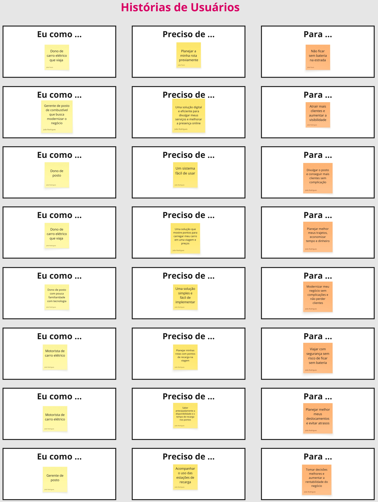

## Proposta de Valor

## Requisitos

As tabelas que se seguem apresentam os requisitos funcionais e não funcionais que detalham o escopo do projeto.

### Requisitos Funcionais

## Requisitos Funcionais

| ID     | Descrição do Requisito                                                                                  | Prioridade |
| ------ | ------------------------------------------------------------------------------------------------------- | ---------- |
| RF-001 | O sistema deve permitir o cadastro de novos usuários.                                                   | ALTA       |
| RF-002 | O sistema deve permitir que usuários autenticados realizem login e logout.                              | ALTA       |
| RF-003 | O sistema deve permitir ao usuário visualizar os postos de recarga cadastrados em mapa e em lista.      | ALTA       |
| RF-004 | O sistema deve permitir cadastrar, editar e excluir postos de recarga (administrador).                  | ALTA       |
| RF-005 | O sistema deve permitir visualizar os detalhes completos de um posto de recarga.                        | MÉDIA      |
| RF-006 | O sistema deve permitir adicionar e remover postos da lista de favoritos do usuário.                    | ALTA       |
| RF-007 | O sistema deve permitir pesquisar e filtrar postos favoritados.                                         | MÉDIA      |
| RF-008 | O sistema deve permitir calcular rotas entre origem e destino informados pelo usuário.                  | ALTA       |
| RF-009 | O sistema deve exibir distância, tempo estimado e quantidade de postos ao longo da rota.                | ALTA       |
| RF-010 | O sistema deve permitir visualizar a localização atual do usuário e traçar rotas até postos de recarga. | ALTA       |
| RF-011 | O sistema deve permitir simular o tempo de recarga de um veículo elétrico.                              | ALTA       |
| RF-012 | O sistema deve armazenar e exibir o histórico de simulações, viagens e favoritos do usuário.            | MÉDIA      |
| RF-013 | O sistema deve permitir ao usuário editar seus dados cadastrais mediante confirmação.                   | MÉDIA      |
| RF-014 | O sistema deve manter a sessão do usuário durante a navegação na aplicação.                             | ALTA       |

### Requisitos não Funcionais

## Requisitos Não Funcionais

| ID      | Descrição do Requisito                                                                                                    | Prioridade |
| ------- | ------------------------------------------------------------------------------------------------------------------------- | ---------- |
| RNF-001 | O sistema deve ser desenvolvido utilizando HTML5, CSS3 e JavaScript (ECMAScript).                                         | ALTA       |
| RNF-002 | O sistema deve utilizar um servidor REST (JSON Server) para persistência dos dados.                                       | ALTA       |
| RNF-003 | O sistema deve ser compatível com os principais navegadores modernos (Google Chrome, Microsoft Edge e Mozilla Firefox).   | ALTA       |
| RNF-004 | O sistema deve apresentar interface responsiva para diferentes resoluções de tela.                                        | MÉDIA      |
| RNF-005 | O sistema deve utilizar a API OpenStreetMap/Nominatim para geocodificação de endereços.                                   | ALTA       |
| RNF-006 | O sistema deve utilizar APIs de roteamento (OpenRouteService e OSRM) para cálculo de trajetos.                            | ALTA       |
| RNF-007 | O sistema deve utilizar a biblioteca Leaflet para renderização de mapas interativos.                                      | ALTA       |
| RNF-008 | O tempo médio de resposta das operações locais deve ser inferior a 3 segundos, desconsiderando atrasos das APIs externas. | MÉDIA      |
| RNF-009 | A autenticação do usuário deve ser mantida durante a sessão utilizando Session Storage do navegador.                      | MÉDIA      |
| RNF-010 | A aplicação deve consumir imagens externas sem armazená-las localmente, utilizando URLs fornecidas pelo Unsplash.         | BAIXA      |

## Projeto de Interface

Artefatos relacionados com a interface e a interacão do usuário na proposta de solução.

### Wireframes

### User Flow

### Protótipo Interativo

https://inside-sleet-45413344.figma.site

# Metodologia

Detalhes sobre a organização do grupo e o ferramental empregado.

## Ferramentas

Relação de ferramentas empregadas pelo grupo durante o projeto.

whatsapp - comunicação
Discord - comunicação
Google - Pesquisa
Miro - diagramação - https://miro.com/app/board/uXjVGvR6Pi0=/?share_link_id=410012000461
VS code - editor de cóodigo
Figma - diagramação - https://inside-sleet-45413344.figma.site
Render -hospefagem - https://pmg-es-2026-1-ti1-0427200-ideal-2.onrender.com/modulos/mapa/mapa.html

## Gerenciamento do Projeto

Divisão de papéis no grupo e apresentação da estrutura da ferramenta de controle de tarefas (Kanban).

Brendon Leonardo = Desenvolvimento
Crispim Bruno = Product Owner
Gabriel do Carmo = Scrum Master
João Paulo - Desenvolvimento
Marcelo Artur - Desenvolvimento
Matheus Possemato - Desenvolvimento

Crispim foi designado para entrega dos trabalhos e realização de atividades como documentação, além de coordernar o ritmo e tomada de decisão do que ser feito no projeto e projetar o mapa / Editor de perfil.

Gabriel foi designado a verificar o funcionamento do site e concertar erros que possam interferir em outras partes, fora a própria de projetar o planejador de viajens e a página postos (adm).

João foi designado para auxilio nas tomadas de decisão e controle do pessoal, além da manutenção do site e o projeto da aba favoritos.

Marcelo foi designado a projetar o cadastro do site e teve participação no projeto do historico.
Matheus foi designado a projetar o simulador de viajens.
Brendon foi designado a projetar o historico do usuário.

# Solução Implementada

Esta seção apresenta todos os detalhes da solução criada no projeto.

## Vídeo do Projeto

O vídeo a seguir traz uma apresentação do problema que a equipe está tratando e a proposta de solução.

https://drive.google.com/drive/folders/1vR13VulaUDAAJg098OXBF9kd42r8R51I?usp=sharing

## Funcionalidades

### Favoritos

#### Funcionalidade 1 - Listagem de postos favoritos do usuário logado 

 Exibe os postos de recarga que o usuário atualmente autenticado marcou como favoritos. A lista é personalizada por usuário: o módulo identifica quem está logado a partir da sessão (sessionStorage) e exibe apenas os favoritos vinculados àquele usuário. Quando não há ninguém logado, nenhum favorito é exibido e a página orienta o usuário a efetuar login. 

 Justificativa: é a funcionalidade central do módulo. Garante que cada usuário veja somente os seus próprios postos favoritos, atendendo ao requisito de personalização e privacidade dos dados de cada conta. 

 Estrutura de dados: Favoritos, Postos, Usuário Atual 

 Instruções de acesso:  

 -Abrir o site e efetuar o login 
 -No menu lateral, escolher a opção Favoritos 
 -A página carrega automaticamente os postos favoritos do usuário logado 

 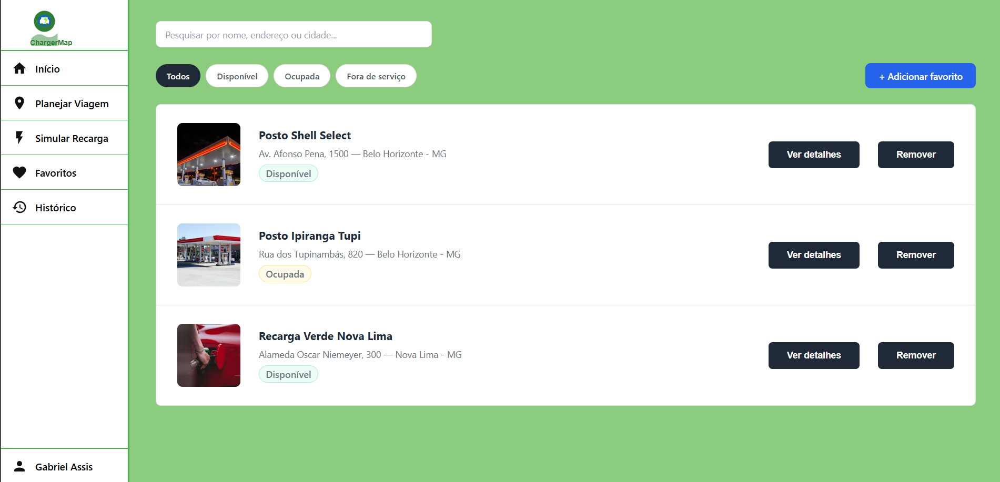

#### Funcionalidade 2 - Adicionar posto aos favoritos 

 Permite que o usuário logado adicione um posto à sua lista de favoritos. Ao acionar a ação, é exibido um modal contendo apenas os postos que ainda não fazem parte da lista de favoritos do usuário, evitando duplicidade. 

 Justificativa: dá ao usuário autonomia para montar a própria lista de postos de interesse, sem depender de cadastro manual em banco de dados. 

Estrutura de dados: Favoritos, Postos 

 Instruções de acesso:  

 -Na página de Favoritos, clicar no botão Adicionar favorito 
 -Escolher o posto desejado na lista do modal 
 -Clicar em Adicionar; o posto passa a aparecer na lista de favoritos 

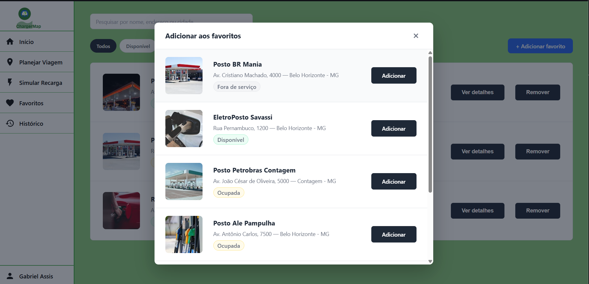

#### Funcionalidade 3 - Remover posto dos favoritos 

 Permite que o usuário logado retire um posto da sua lista de favoritos. A alteração é persistida no servidor. 

 Justificativa: complementa a funcionalidade de adição, permitindo que o usuário mantenha a lista atualizada conforme seus interesses mudam. 

 Estrutura de dados: Favoritos 

 Instruções de acesso:  

 -Na página de Favoritos, localizar o card do posto desejado 
 -Clique no botão Remover do card 

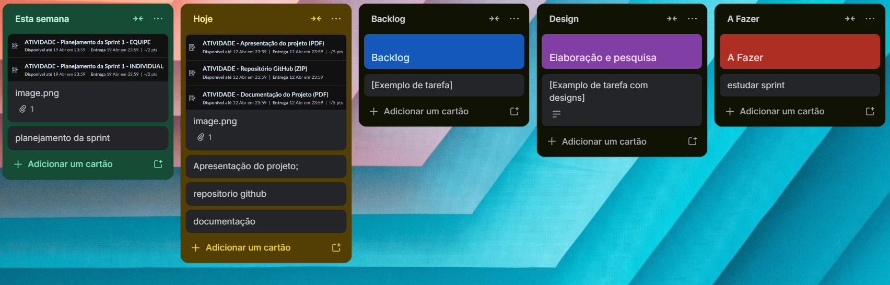

#### Funcionalidade 4 - Pesquisa e filtro de favoritos 

 Permite localizar postos dentro da lista de favoritos por meio de uma barra de pesquisa (que considera nome, endereço e cidade) e de filtros por status de operação (Todos, Disponível, Ocupada, Fora de serviço). 

 Justificativa: melhora a usabilidade quando o usuário possui muitos postos favoritados, permitindo encontrar rapidamente o posto desejado. 

 Estrutura de dados: Postos 

 Instruções de acesso:  

 -Na página de Favoritos, digitar um termo na barra de pesquisa, ou 
 -Clicar em um dos botões de filtro de status na barra de ações 

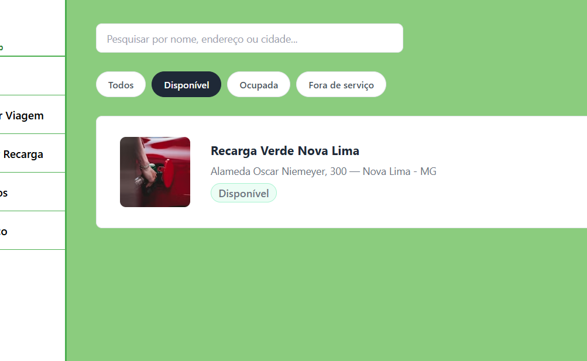

#### Funcionalidade 5 - Visualização de detalhes do posto 

 Exibe uma página com os dados completos de um posto favoritado, incluindo endereço, telefone, horário de funcionamento e, quando aplicável, as informações do ponto de recarga elétrica (conector, potência e número de tomadas). 

 Justificativa: concentra em uma única tela todas as informações necessárias para o usuário decidir se vai utilizar aquele posto. 

 Estrutura de dados: Postos 

 Instruções de acesso:  

 -Na página de Favoritos, no card do posto desejado, clicar em Ver detalhes 

### Postos: 

#### Funcionalidade 1 - Listagem de Postos de Recarga 

Exibe em cards todos os postos de recarga cadastrados no sistema. Cada card apresenta a imagem, nome, endereço, cidade e telefone do posto. A lista é carregada dinamicamente a partir do servidor REST ao abrir a página. 

Justificativa: É a funcionalidade central do módulo de postos. Permite que administradores visualizem rapidamente todos os pontos de recarga cadastrados, servindo de ponto de partida para edição e exclusão. 

Estrutura de dados: Postos 

Instruções de acesso: 

- Acessar a página postos.html 
- Os cards dos postos são renderizados automaticamente ao carregar a página 

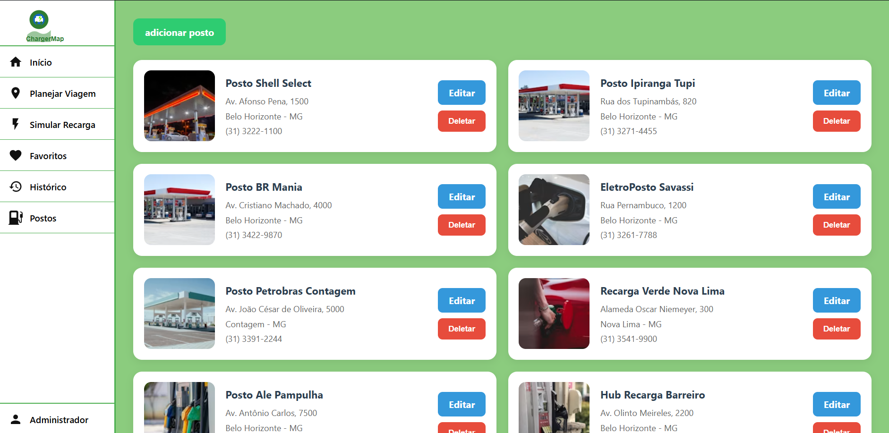

#### Funcionalidade 2 - Cadastrar Novo Posto 

Permite registrar um novo posto de recarga no sistema. O formulário solicita nome, endereço, cidade, telefone, horário de funcionamento e URL de imagem. Ao salvar, as coordenadas geográficas (latitude e longitude) são obtidas automaticamente via API de geocodificação (Nominatim/OpenStreetMap) a partir do endereço e cidade informados. 

Justificativa: Centraliza o cadastro de novos pontos de recarga, garantindo que as coordenadas geográficas sejam sempre preenchidas de forma automática e consistente, sem exigir que o administrador informe latitude e longitude manualmente. 
 
Estrutura de dados: Postos 

Instruções de acesso: 

-Na página postos.html, clicar em Adicionar posto 
-Preencher todos os campos do formulário na página editPosto.html 
-Clicar em Salvar Posto; o sistema geocodifica o endereço e persiste o registro 
-O usuário é redirecionado de volta para postos.html 

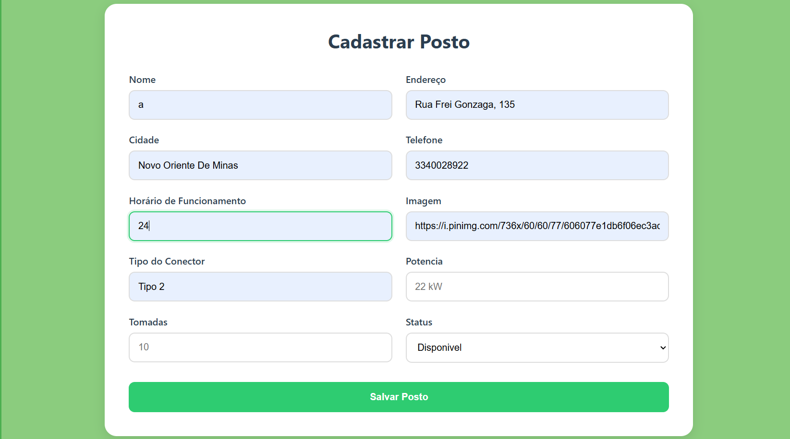

#### Funcionalidade 3 - Editar Posto Existente 

Permite alterar os dados de um posto já cadastrado. Ao acessar a tela de edição, os campos são preenchidos automaticamente com as informações atuais do posto. Após a alteração, as coordenadas geográficas são recalculadas com base no endereço e cidade atualizados. 

Justificativa: Garante que os dados dos postos permaneçam atualizados, inclusive as coordenadas geográficas usadas pelo mapa e pelo planejador de viagem para exibir os marcadores corretamente. 

Estrutura de dados: Postos 

Instruções de acesso: 

-Na página postos.html, no card do posto desejado, clicar em Editar 
-Alterar os campos necessários na página editPosto.html 
-Clicar em Atualizar Posto para salvar as alterações 

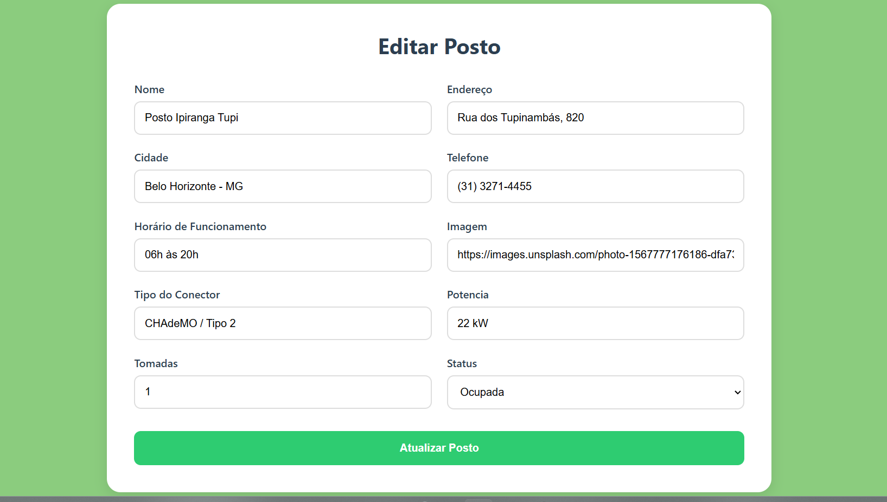

#### Funcionalidade 4 - Excluir Posto 

Permite remover permanentemente um posto do sistema. Antes de efetivar a exclusão, o sistema exibe uma caixa de confirmação para evitar exclusões acidentais. 

Justificativa: Oferece ao administrador o controle completo sobre o catálogo de postos, permitindo remover registros desatualizados ou incorretos. 

Estrutura de dados: Postos 

Instruções de acesso: 

-Na página postos.html, no card do posto desejado, clicar em Deletar 
-Confirmar a exclusão na caixa de diálogo exibida 
-A página é recarregada e o posto não aparece mais na listagem 

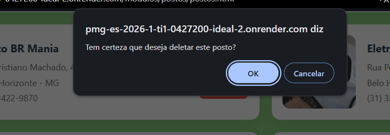

### Planejador: 

#### Funcionalidade 1 - Calcular Rota entre Dois Endereços 

Permite ao usuário informar um endereço de saída e um de destino em texto livre. O sistema geocodifica ambos os endereços via Nominatim (OpenStreetMap) e consulta a API OpenRouteService para obter a rota de carro mais adequada, que é então desenhada no mapa interativo (Leaflet). 

Justificativa: É a funcionalidade principal do planejador. Transforma endereços em texto (sem necessidade de coordenadas manuais) em uma rota visual no mapa, reduzindo a fricção para o usuário que deseja planejar uma viagem de veículo elétrico. 

Estrutura de dados: Postos (para exibição dos marcadores no mapa) 

Instruções de acesso: 

-Acessar a página planejador.html 
-Digitar o endereço de saída no primeiro campo 
-Digitar o endereço de destino no segundo campo 
-Clicar em Calcular; a rota é exibida no mapa 

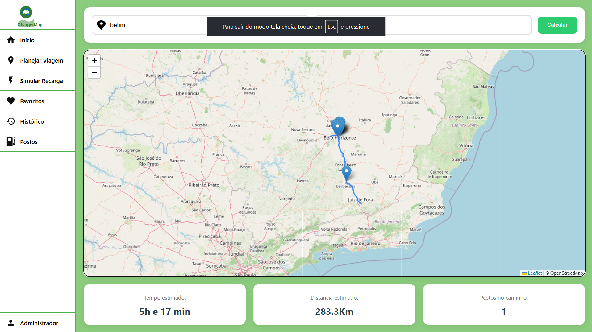

#### Funcionalidade 2 - Exibir Tempo e Distância Estimados da Viagem 

Após o cálculo da rota, exibe o tempo estimado de viagem (em horas e minutos) e a distância total em quilômetros. Os dados são extraídos diretamente da resposta da API OpenRouteService e apresentados na seção de resultados abaixo do mapa. 

Justificativa: Fornece ao usuário informações essenciais para planejar a viagem, como o tempo necessário e o consumo esperado de bateria, sem precisar consultar outro aplicativo. 

Estrutura de dados: Nenhuma (dados retornados diretamente pela API de rota) 

Instruções de acesso: 

-Calcular uma rota conforme a Funcionalidade 5 
-Os valores de tempo e distância são exibidos automaticamente na seção de resultados 

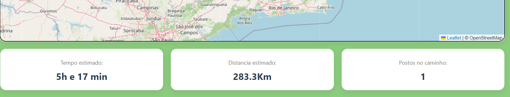

#### Funcionalidade 3 - Contagem de Postos no Trajeto 

Identifica e contabiliza os postos de recarga cadastrados que estão a até 500 metros de algum ponto da rota calculada. A contagem é exibida na seção de resultados como "Postos no caminho". 

Justificativa: Permite ao usuário saber quantas opções de recarga existem ao longo do trajeto planejado, facilitando a decisão de quando e onde parar para carregar o veículo elétrico. 

Estrutura de dados: Postos 

Instruções de acesso: 

-Calcular uma rota conforme a Funcionalidade 5 
-O número de postos próximos à rota é exibido automaticamente na seção de resultados 

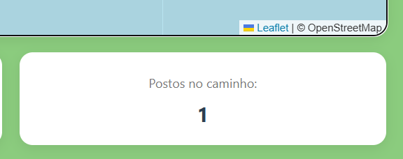

#### Funcionalidade 4 - Mapa Interativo com Marcadores de Postos 

Exibe um mapa interativo (Leaflet + OpenStreetMap) com marcadores em todos os postos cadastrados que possuem coordenadas válidas. Ao clicar em um marcador, é exibido um popup com o nome e o tipo de conector do posto. A rota calculada é sobreposta ao mapa como uma camada GeoJSON. 

Justificativa: Oferece uma visão espacial de todos os pontos de recarga disponíveis, ajudando o usuário a identificar postos próximos à rota e planejar paradas estratégicas. 

Estrutura de dados: Postos 

Instruções de acesso: 

-Acessar a página planejador.html; os marcadores são carregados automaticamente 
-Clicar em qualquer marcador para ver o nome e o tipo de conector do posto 
-Calcular uma rota para visualizá-la sobreposta aos marcadores 

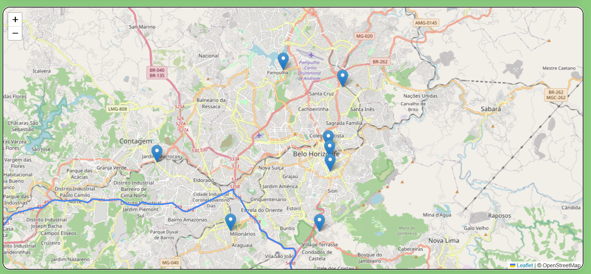

### Mapa 

#### Funcionalidade 1 - Exibição dos postos no mapa 

Carrega todos os postos de recarga cadastrados via requisição GET /postos e os exibe como marcadores interativos no mapa Leaflet. Ao clicar em um marcador, um popup é exibido com o nome e o tipo de conector do posto. 

Justificativa: é a funcionalidade central do módulo. Permite que o usuário visualize todos os pontos de recarga disponíveis em Belo Horizonte e região sobre um mapa interativo. 

Estrutura de dados: Postos 

Instruções de acesso: 

-Abrir a página mapa.html 
-Os marcadores são renderizados automaticamente ao carregar a página 
-Clicar em qualquer marcador exibe o popup com nome e tipo de conector 

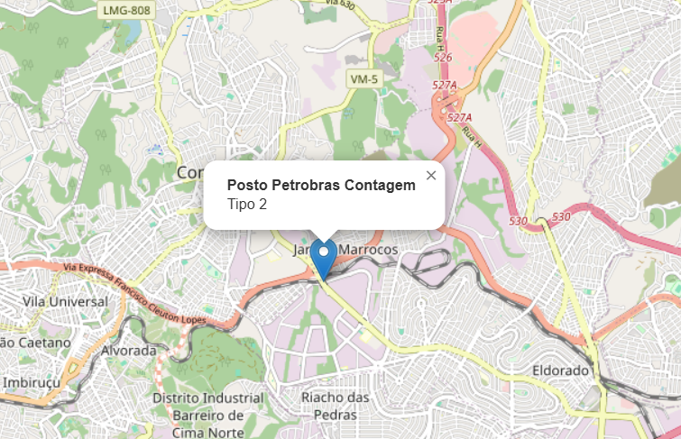

#### Funcionalidade 2 - Lista de postos próximos 

Além do mapa, a página exibe uma lista lateral com cards de todos os postos carregados, contendo nome, endereço, tipo de conector, potência, horário e status de operação. Ao clicar em um card, o mapa centraliza no posto correspondente e abre o popup do marcador. 

Justificativa: complementa o mapa com uma visão em lista, facilitando a leitura dos dados de cada posto sem precisar interagir com os marcadores. 

Estrutura de dados: Postos 

Instruções de acesso: 

-Na página mapa.html, a lista é exibida na seção lateral 
-Clicar em um card centraliza o mapa no posto e abre o popup 

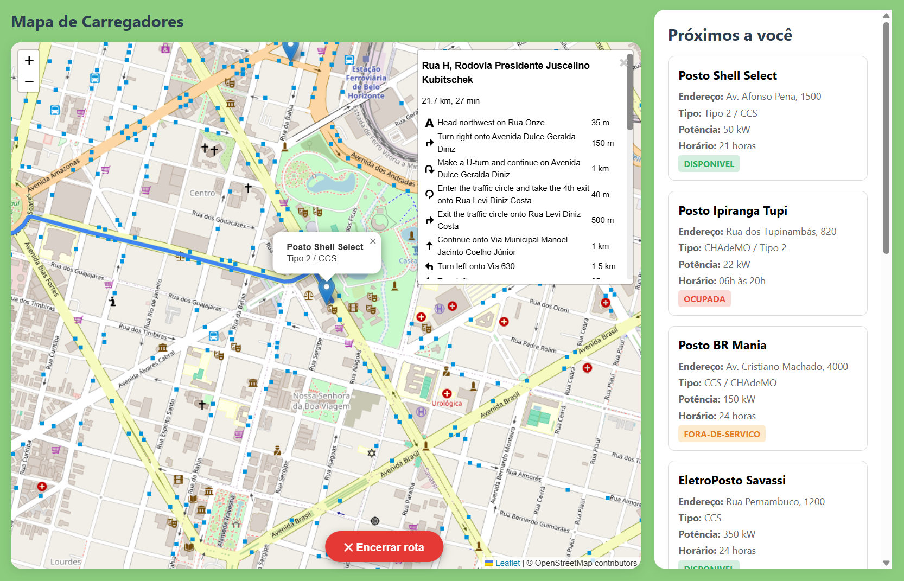

#### Funcionalidade 3 - Localização do usuário (GPS) 

Detecta a posição atual do usuário via API de Geolocalização do navegador (getCurrentPosition) e exibe um marcador azul estilo GPS no mapa. A posição é atualizada automaticamente ao iniciar o acompanhamento de rota. 

Justificativa: permite que o usuário saiba onde está em relação aos postos exibidos, servindo de ponto de partida para o traçado de rotas. 

Estrutura de dados: nenhuma (dado obtido diretamente do navegador) 

Instruções de acesso: 

-Ao abrir mapa.html, o navegador solicita permissão de localização 
-Ao conceder, o marcador azul é exibido na posição atual 

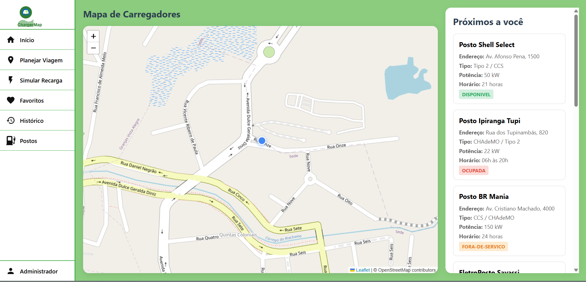

#### Funcionalidade 4 - Traçar rota até o posto 

Ao clicar em um card de posto, se a localização do usuário estiver disponível, uma rota é calculada automaticamente entre a posição atual e o posto selecionado usando o serviço OSRM (routing.openstreetmap.de). A rota é exibida no mapa com linha azul. Caso já exista uma rota ativa, ela é removida antes de traçar a nova. 

Justificativa: oferece ao usuário navegação direta até o posto escolhido, sem precisar sair da aplicação. 

Estrutura de dados: Postos 

Instruções de acesso: 

-Conceder permissão de localização 
-Clicar em um card de posto na lista lateral 
-A rota é traçada automaticamente entre o usuário e o posto 

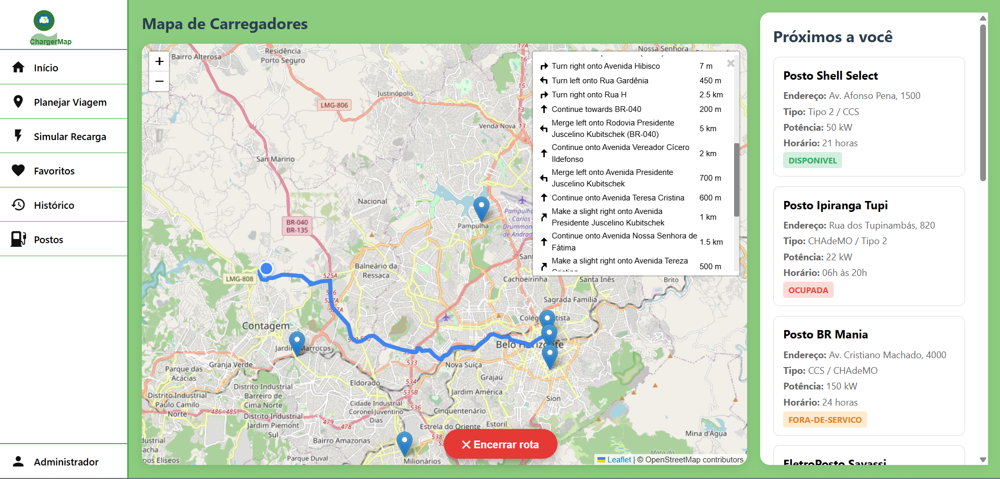

#### Funcionalidade 5 - Acompanhamento em tempo real 

Após iniciar uma rota, a posição do usuário é monitorada continuamente via watchPosition. O waypoint de origem da rota é atualizado a cada nova posição recebida, mantendo a navegação ativa. 

Justificativa: garante que a rota reflita a posição real do usuário enquanto ele se desloca, sem precisar recalcular manualmente. 

Estrutura de dados: nenhuma (dado obtido diretamente do navegador) 

Instruções de acesso: 

-O acompanhamento inicia automaticamente ao traçar uma rota 
-A posição no mapa é atualizada a cada deslocamento detectado 

> não consigo foto dessa funconalidade

#### Funcionalidade 6 - Encerrar rota 

Um botão flutuante 'Encerrar rota' é criado dinamicamente ao iniciar o acompanhamento. Ao clicar, a rota é removida do mapa, o watchPosition é cancelado e o botão é destruído. 

Justificativa: dá ao usuário controle para encerrar a navegação ativa quando desejar. 

Estrutura de dados: nenhuma 

Instruções de acesso: 

-Com uma rota ativa, clicar no botão vermelho 'Encerrar rota' na base da tela 

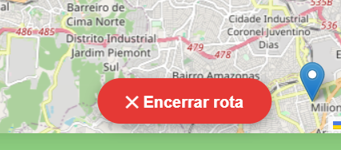

### Perfil 

#### Funcionalidade 1 - Visualização dos dados do perfil 

Ao carregar a página, os dados do usuário logado são lidos do sessionStorage (chave usuarioCorrente) e preenchidos nos campos do formulário em modo somente leitura. Caso não exista sessão ativa, o usuário é redirecionado para login.html. 

Justificativa: permite ao usuário consultar suas informações cadastradas sem risco de alteração acidental. 

Estrutura de dados: Usuário Corrente 

Instruções de acesso: 

-Efetuar login na aplicação 
-Navegar para perfil.html 
-Os campos são preenchidos automaticamente com os dados da sessão 

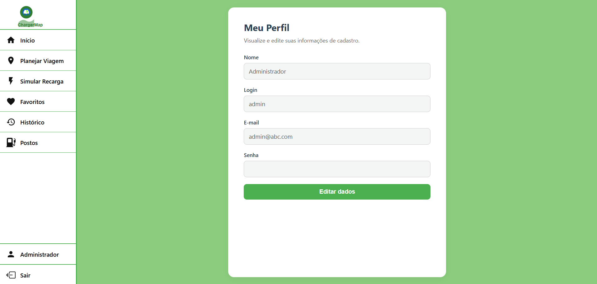

#### Funcionalidade 2 - Edição dos dados do perfil 

O botão 'Editar dados' habilita os campos de nome, e-mail e senha para edição. Os botões 'Salvar alterações' e 'Cancelar' são exibidos. O campo login permanece desabilitado em todos os modos. 

Justificativa: permite ao usuário manter seus dados atualizados de forma controlada, sem expor o campo de login a alterações. 

Estrutura de dados: Usuário Corrente 

Instruções de acesso: 

-Na página perfil.html, clicar em Editar dados 
-Alterar os campos desejados 
-Clicar em Salvar alterações ou Cancelar para descartar 

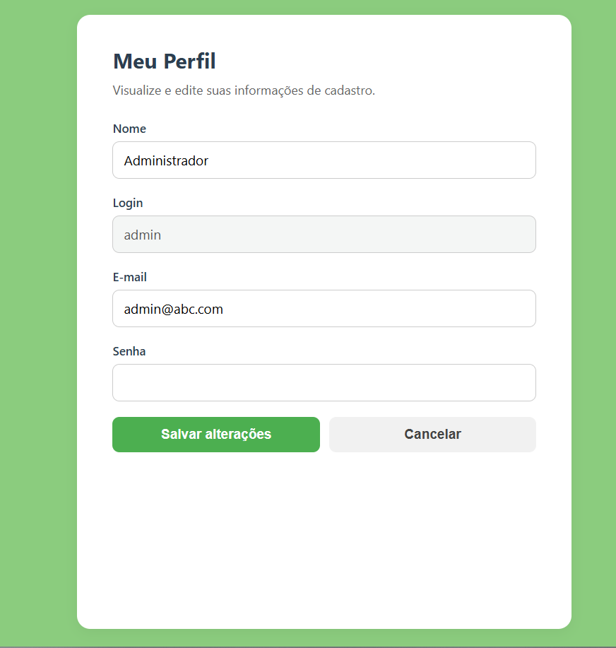

#### Funcionalidade 3 - Verificação por código antes de salvar 

Ao submeter o formulário de edição, um modal de confirmação é exibido simulando o envio de um código de 4 dígitos para o e-mail do usuário. O e-mail é exibido parcialmente mascarado. O código válido na simulação é 0000. 

Justificativa: adiciona uma camada de segurança antes de persistir alterações nos dados da conta, evitando mudanças acidentais ou não autorizadas. 

Estrutura de dados: Usuário Corrente 

Instruções de acesso: 

-Após editar os campos, clicar em Salvar alterações 
-Digitar o código 0000 no modal exibido
-Clicar em Confirmar 

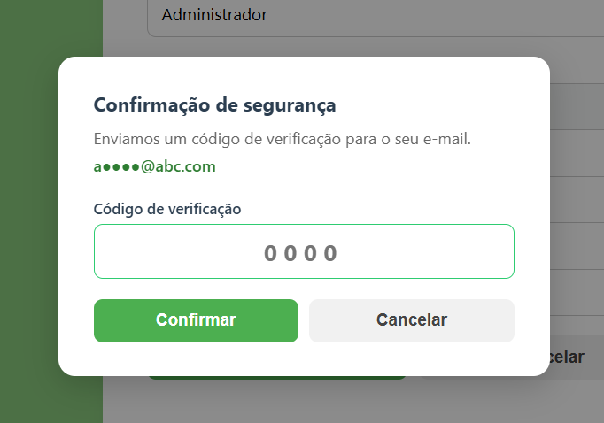

#### Funcionalidade 4 - Persistência das alterações 

Após validação do código, os dados atualizados (nome, e-mail e senha) são enviados ao servidor via PATCH /usuarios/:id. O sessionStorage é atualizado com o objeto retornado pela API. O formulário retorna ao modo de visualização e uma mensagem de sucesso é exibida. 

Justificativa: garante que as alterações sejam salvas tanto no servidor quanto na sessão ativa, mantendo consistência entre os dados exibidos e os armazenados. 

Estrutura de dados: Usuário Corrente, Usuários 

Instruções de acesso: 

-Confirmar o código no modal de verificação 
-A mensagem 'Dados atualizados com sucesso!' é exibida ao concluir 

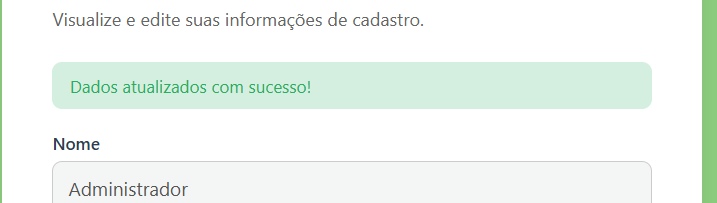

#### Funcionalidade 5 - Logout 

O botão 'Sair' na barra lateral encerra a sessão gravando { login: false } no sessionStorage e redireciona o usuário para a página do mapa. 

Justificativa: permite ao usuário encerrar a sessão de forma segura a partir de qualquer página que contenha a sidebar. 

Estrutura de dados: Usuário Corrente 

Instruções de acesso: 

-Na barra lateral, clicar em Sair

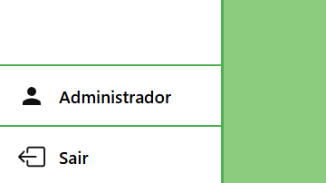

### login e cadastro

#### Funcionalidade 1 - Login de Usuário 

Permite que um usuário registrado acesse a aplicação informando seu login e senha. O sistema valida as credenciais comparando com os registros obtidos via API REST. Se a autenticação for bem-sucedida, os dados do usuário são gravados no sessionStorage e ele é redirecionado para a tela do mapa. Caso contrário, um alerta informa que o usuário ou a senha estão incorretos. 

Justificativa: É a porta de entrada da aplicação. Garante que somente usuários cadastrados acessem as funcionalidades protegidas, e persiste a identidade do usuário na sessão para que outros módulos (como Favoritos e Postos) possam identificar quem está logado. 

Estrutura de dados: Usuários, Usuário Corrente (sessionStorage) 

Instruções de acesso: 

-Acessar a página login.html 
-Informar o login e a senha nos campos correspondentes 
-Clicar em Submit 
-Se as credenciais forem válidas, o sistema redireciona para mapa/mapa.html 
-Se inválidas, um alerta é exibido 

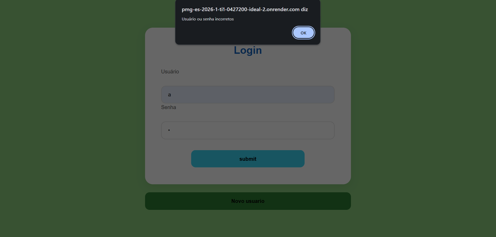

#### Funcionalidade 2 - Cadastro de Novo Usuário 

Permite que um visitante crie uma nova conta na aplicação. Ao clicar em Novo usuário, um modal é exibido com campos para login, nome completo, e-mail, senha e confirmação de senha. O sistema valida se as senhas conferem antes de persistir o registro. Após o cadastro, um registro de favoritos vazio é criado automaticamente para o novo usuário. 

Justificativa: Permite que qualquer pessoa se registre sem depender de um administrador, automatizando também a criação do perfil de favoritos vinculado à conta, o que mantém a consistência dos dados entre os módulos. 

Estrutura de dados: Usuários, Favoritos 

Instruções de acesso: 

-Na página login.html, clicar em Novo usuário 
-Preencher todos os campos do modal (login, nome, e-mail, senha e confirmação) 
-Clicar em Salvar 
-Se as senhas não conferirem, um alerta é exibido e o cadastro não é realizado 
-Se válido, o usuário é inserido e o modal é fechado; proceder com o login normalmente 

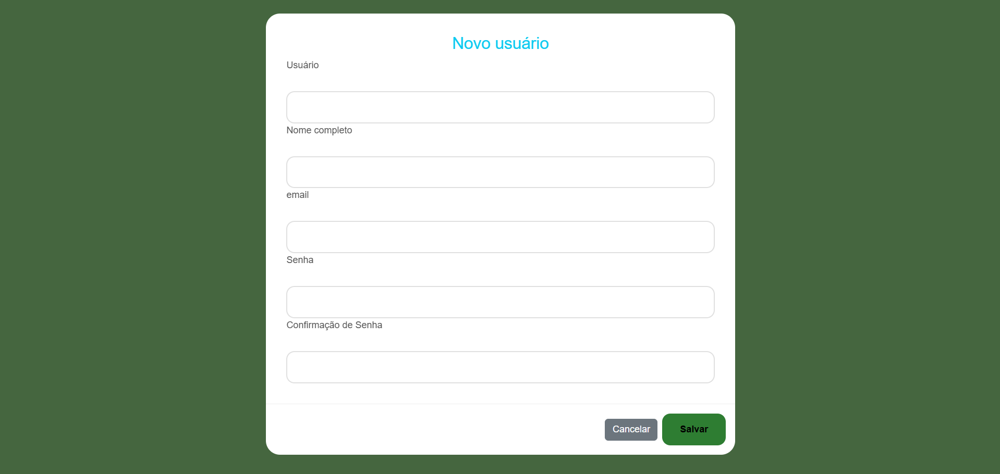

#### Funcionalidade 3 - Persistência da Sessão do Usuário (sessionStorage) 

Após o login bem-sucedido, os dados do usuário autenticado (id, login, e-mail, nome e flag admin) são serializados em JSON e armazenados na chave usuarioCorrente do sessionStorage do navegador. Ao inicializar, o módulo verifica se já existe um usuário salvo na sessão e o restaura automaticamente, evitando que o usuário precise logar novamente ao navegar entre páginas. 

Justificativa: Centraliza a identidade do usuário logado em um local de fácil acesso para todos os módulos da aplicação, sem exigir chamadas extras ao servidor a cada troca de página. 

Estrutura de dados: Usuário Corrente (sessionStorage) 

Instruções de acesso: 

-A persistência ocorre automaticamente após um login bem-sucedido 
-Para verificar: abrir o DevTools do navegador → aba Application → Session Storage 
-A chave usuarioCorrente conterá o objeto JSON do usuário autenticado 

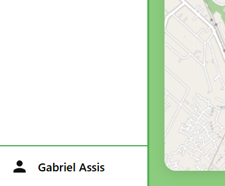

#### Funcionalidade 4 - Carregamento Assíncrono de Usuários com Promessa de Inicialização 

Ao inicializar, o módulo dispara uma requisição GET ao endpoint /usuarios do JSON Server e armazena os registros em memória (db_usuarios). Uma Promise interna (usuariosPromise) garante que a função loginUser sempre aguarde a conclusão do fetch antes de tentar validar as credenciais, mesmo que a requisição demore mais do que o esperado. 

Justificativa: Evita condições de corrida em que o formulário de login poderia ser submetido antes de os dados dos usuários serem carregados, o que resultaria em falha de autenticação mesmo com credenciais corretas. 

Estrutura de dados: Usuários 

Instruções de acesso: 

-O carregamento ocorre automaticamente quando login.js é incluído na página 
-Não requer interação do usuário; é transparente ao fluxo de uso

> não tenho como colocar foto dessa função

### Simulador 

#### Funcionalidade 1 - Simulação de tempo de recarga 

Permite ao usuário calcular o tempo estimado para recarregar a bateria do veículo. O usuário informa a carga atual, a meta de carga desejada e o tipo de carregador. O sistema calcula a energia necessária com base em uma bateria de referência de 60 kWh e divide pela potência do carregador selecionado para obter o tempo estimado em horas e minutos. 

Justificativa: fornece ao usuário uma estimativa rápida e prática de quanto tempo precisará aguardar em um posto de recarga, sem depender de dados externos ou conexão com o servidor. 

Estrutura de dados: nenhuma (cálculo feito inteiramente no cliente) 

Instruções de acesso: 

-Abrir a página index.html do módulo simulador 
-Ajustar o slider de Carga Atual para o percentual atual da bateria 
-Ajustar o slider de Meta de Carga para o percentual desejado 
-Selecionar o tipo de carregador no menu suspenso 
-Clicar em Simular; o tempo estimado e a energia necessária são exibidos 

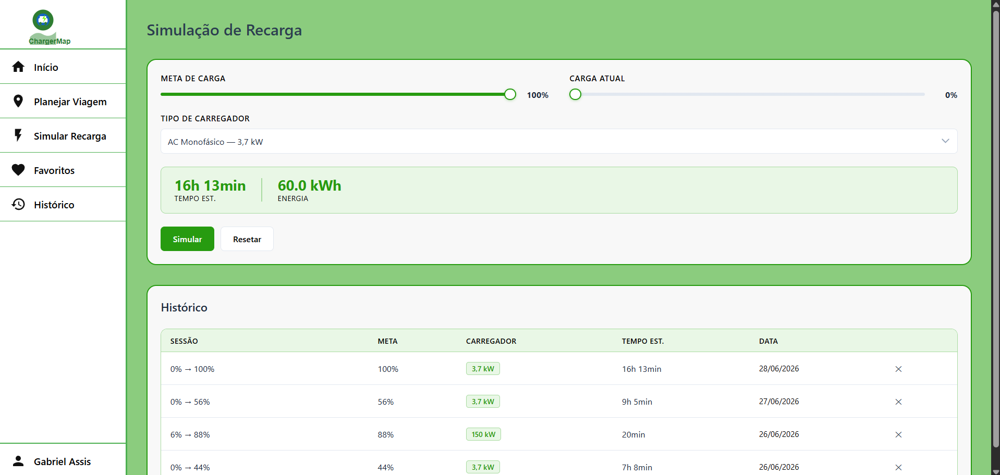

#### Funcionalidade 2 - Exibição do resultado inline 

Após a simulação, os resultados (tempo estimado e energia em kWh) são exibidos em um painel verde inline abaixo do formulário, sem recarregar a página. O painel fica oculto até que a primeira simulação seja realizada. 

Justificativa: mantém o fluxo da página fluido, exibindo o resultado de forma contextual sem navegação adicional. 

Estrutura de dados: nenhuma 

Instruções de acesso: 

-Realizar uma simulação conforme a Funcionalidade 1 
-O painel de resultado aparece automaticamente abaixo do formulário 

#### Funcionalidade 3 - Salvar simulação no histórico 

Ao concluir uma simulação, o resultado é salvo automaticamente no servidor via POST /simulacoes, vinculado ao id do usuário logado. Caso o usuário não esteja autenticado, um alerta é exibido e o salvamento é bloqueado. Se o histórico do usuário já tiver 10 registros, a simulação mais antiga é removida automaticamente antes de salvar a nova. 

Justificativa: permite que o usuário consulte simulações anteriores em sessões futuras, mantendo um histórico pessoal persistido no servidor. 

Estrutura de dados: Simulações, Usuário Corrente 

Instruções de acesso: 

-Estar logado na aplicação 
-Realizar uma simulação; o registro é salvo automaticamente ao clicar em Simular 

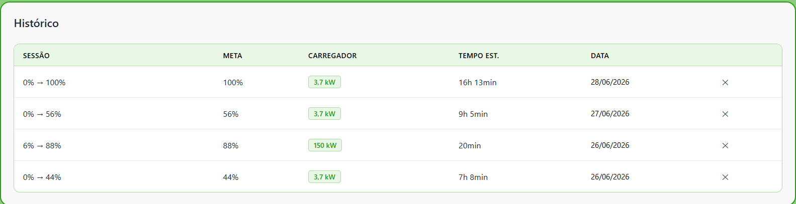

#### Funcionalidade 4 - Carregar histórico do usuário logado 

Ao abrir a página, o módulo consulta GET /simulacoes?usuarioId=:id e exibe na tabela de histórico apenas as simulações vinculadas ao usuário autenticado. Se não houver ninguém logado, a tabela permanece oculta. Se não houver registros, a mensagem 'Nenhuma simulação realizada ainda.' é exibida. 

Justificativa: garante que cada usuário veja apenas o próprio histórico, atendendo ao requisito de personalização e privacidade dos dados. 

Estrutura de dados: Simulações, Usuário Corrente 

Instruções de acesso: 

-Efetuar login e abrir a página index.html do módulo simulador 
-A tabela é preenchida automaticamente com as simulações do usuário logado 

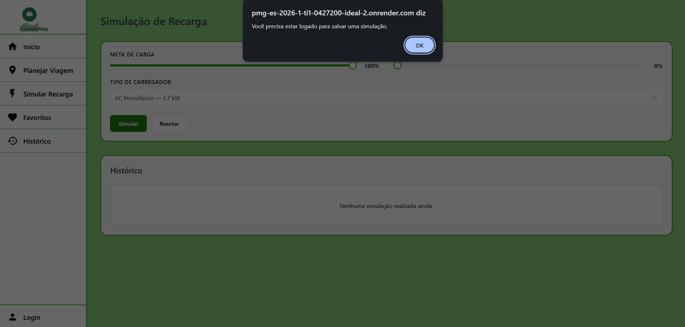

#### Funcionalidade 5 - Remover simulação do histórico 

Cada linha da tabela de histórico possui um botão de remoção. Ao clicar, o registro é excluído do servidor via DELETE /simulacoes/:id e removido da tabela sem recarregar a página. A remoção só é permitida se o usuário logado for o dono da simulação. 

Justificativa: permite ao usuário manter o histórico limpo, removendo simulações que não têm mais interesse. 

Estrutura de dados: Simulações 

Instruções de acesso: 

-Na tabela de histórico, clicar no botão ✕ na linha da simulação desejada 
-O registro é removido imediatamente da tabela e do servidor 

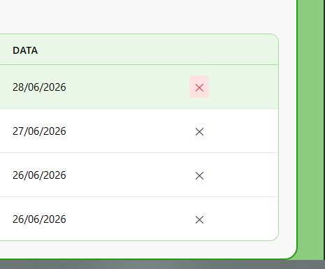

#### Funcionalidade 6 - Resetar formulário 

O botão Resetar retorna os dois sliders para 0%, oculta o painel de resultado inline e limpa os valores exibidos, sem apagar o histórico. 

Justificativa: facilita a realização de uma nova simulação sem precisar recarregar a página. 

Estrutura de dados: nenhuma 

Instruções de acesso: 

-Clicar no botão Resetar 
-Os sliders voltam a 0% e o painel de resultado some 

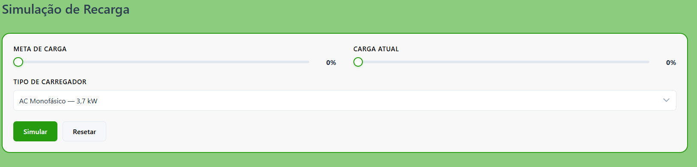

### Histórico 

#### Funcionalidade 1 - Listagem unificada do histórico 

Exibe em cards todos os eventos registrados pelo usuário logado, reunindo em uma única página três tipos de registro: simulações de recarga, viagens planejadas e postos favoritados. Os dados são carregados em paralelo via Promise.all a partir dos endpoints /simulacoes, /favoritos, /postos e /viagem. Cada tipo recebe um ícone distinto para identificação visual rápida. 

Justificativa: centraliza em uma tela só o histórico de atividades do usuário, evitando que ele precise navegar por múltiplos módulos para rever ações anteriores. 

Estrutura de dados: Simulações, Favoritos, Postos, Viagem, Usuário Corrente 

Instruções de acesso: 

-Efetuar login na aplicação 
-No menu lateral, clicar em Histórico 
-A página carrega automaticamente todos os registros do usuário logado 

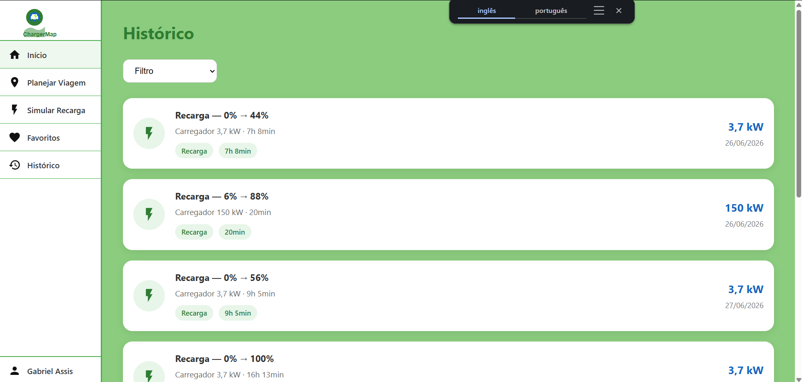

#### Funcionalidade 2 - Filtro por tipo de registro 

Um menu suspenso no topo da página permite filtrar os cards exibidos por tipo: Recarga, Viagem ou Favorito. Ao selecionar uma opção, apenas os cards do tipo correspondente são exibidos, sem recarregar a página. Selecionar a opção vazia (Filtro) volta a exibir todos os registros. 

Justificativa: melhora a usabilidade quando o usuário possui muitos registros, permitindo localizar rapidamente eventos de um tipo específico. 

Estrutura de dados: nenhuma (filtragem feita no cliente sobre os dados já carregados) 

Instruções de acesso: 

-Na página de Histórico, clicar no menu suspenso Filtro 
-Selecionar Recarga, Viagem ou Favorito 
-Os cards são filtrados automaticamente 

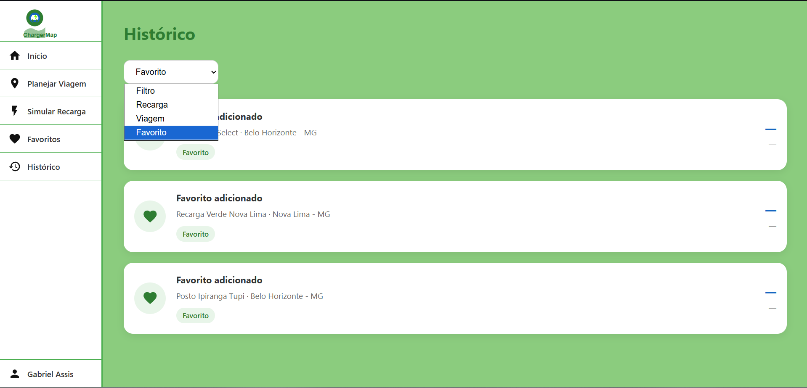

#### Funcionalidade 3 - Cards de simulação de recarga 

Para cada simulação vinculada ao usuário logado, é gerado um card com ícone de raio, título indicando a sessão de carga (ex: Recarga — 7% → 68%), subtítulo com o carregador e tempo estimado, tags e o valor da potência do carregador. 

Justificativa: apresenta o histórico de recargas simuladas de forma visual e resumida, sem exigir que o usuário acesse o módulo de simulação. 

Estrutura de dados: Simulações 

Instruções de acesso: 

-Acessar a página de Histórico estando logado 
-Os cards de recarga são exibidos automaticamente se houver simulações salvas 

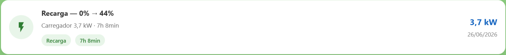

#### Funcionalidade 4 - Cards de viagem planejada 

Para cada viagem vinculada ao usuário logado, é gerado um card com ícone de bússola, título indicando origem e destino (ex: Viagem — Belo Horizonte → São Paulo) e tags com distância, tempo estimado e número de postos no caminho. 

Justificativa: registra as rotas planejadas pelo usuário para consulta futura, complementando o módulo de planejador. 

Estrutura de dados: Viagem 

Instruções de acesso: 

-Acessar a página de Histórico estando logado 
-Os cards de viagem são exibidos automaticamente se houver viagens salvas 

#### Funcionalidade 5 - Cards de postos favoritados 

Para cada posto presente na lista de favoritos do usuário logado, é gerado um card com ícone de coração, título 'Favorito adicionado' e subtítulo com nome e cidade do posto. Os dados do posto são cruzados entre os registros de favoritos e a coleção de postos. 

Justificativa: reúne no histórico os postos que o usuário marcou como favoritos, oferecendo uma visão consolidada do interesse dele na rede de carregadores. 

Estrutura de dados: Favoritos, Postos 

Instruções de acesso: 

-Acessar a página de Histórico estando logado 
-Os cards de favoritos são exibidos automaticamente se o usuário tiver postos favoritados 

## Estruturas de Dados

### Favoritos 

Armazena a relação entre cada usuário e os postos que ele marcou como favoritos. Cada registro associa um usuário (usuarioId) a uma lista de identificadores de postos (postosFavoritos). Os identificadores de posto são guardados como texto, pois um posto pode ter id numérico ("1") ou alfanumérico ("nQFOWm2C1io"); por isso, as comparações no código são sempre feitas convertendo os valores para string. 

{ 
  "id": "1", 
  "usuarioId": 1, 
  "nomeUsuario": "Lucas", 
  "postosFavoritos": ["6", "8", "7", "2", "1"] 
} 

 

### Postos 

Representa os postos de recarga apresentados na aplicação. É a fonte dos dados exibidos nos cards e na tela de detalhes. O campo status assume os valores disponivel, ocupada ou fora-de-servico, e o campo recarga indica se o posto possui ponto de recarga elétrica. 

{ 
  "id": "1", 
  "nome": "Posto Shell Select", 
  "endereco": "Av. Afonso Pena, 1500", 
  "cidade": "Belo Horizonte - MG", 
  "telefone": "(31) 3222-1100", 
  "horario": "24 horas", 
  "recarga": true, 
  "tipoConector": "Tipo 2 / CCS", 
  "potencia": "50 kW", 
  "tomadas": 2, 
  "status": "disponivel", 
  "imagem": "https://images.unsplash.com/photo-1585740452884-2a29a1d21514?w=120&h=120&fit=crop&auto=format", 
  "latitude": -19.9256585, 
  "longitude": -43.9349312 
} 

 

### Usuário Corrente (configuração de sessão) 

Estrutura de configuração mantida no sessionStorage do navegador, na chave usuarioCorrente. É gravada pelo módulo de login e consumida pela página de Favoritos para identificar quem está autenticado. O campo id é usado para localizar o registro de favoritos correspondente. Quando não há ninguém logado, a estrutura fica vazia ({}) ou com login igual a false. 

{ 
  "id": "1", 
  "login": "admin", 
  "email": "admin@abc.com", 
  "nome": "Administrador do Sistema", 
  "admin": true 
}

### Simulações 

Armazena os registros de simulações realizadas pelos usuários. Cada registro está vinculado a um usuário pelo campo usuarioId. O campo tag contém apenas a potência do carregador (ex: '100 kW'), extraída do nome completo da opção selecionada. 

{ 
  "id": "eAlUV-1LJQA", 
  "usuarioId": "EGL9urp-tIY", 
  "sessao": "7% → 68%", 
  "meta": "68%", 
  "tag": "100 kW", 
  "timeStr": "22min", 
  "data": "24/06/2026" 
}

### Viagem 

Armazena as viagens planejadas pelos usuários. Cada registro está vinculado a um usuário pelo campo usuarioId e contém os endereços de saída e destino, além dos dados calculados pela API de rota: distância, tempo estimado e número de postos no trajeto. 

{ 
  "id": "abc123", 
  "usuarioId": "EGL9urp-tIY", 
  "saida": "Belo Horizonte", 
  "destino": "São Paulo", 
  "distancia": "586 km", 
  "tempo": "6h 20min", 
  "postos": 4 
} 

## Módulos e APIs

Esta seção apresenta os módulos, bibliotecas e APIs utilizados no desenvolvimento da solução.

### Linguagem e bibliotecas:

- JavaScript (ECMAScript) — linguagem principal da aplicação, sem utilização de framework de front-end.
- HTML5 — estrutura das páginas da aplicação.
- CSS3 — estilização e responsividade da interface.

### Módulos e APIs do navegador:

- Fetch API — comunicação com o servidor REST por meio de requisições GET, POST, PATCH e DELETE.
- Web Storage API (sessionStorage) — armazenamento do usuário autenticado durante a sessão.
- URLSearchParams — leitura de parâmetros da URL, como o identificador do posto na tela de detalhes.

### Módulos da aplicação:

- `login.js` — autenticação e cadastro de usuários; gerencia o usuário autenticado (`usuarioCorrente`) e exporta as funções de login, logout e cadastro.
- `userLogado.js` — controla o estado de autenticação exibido na interface e realiza o logout.
- `postos.js` — renderiza a listagem de postos e gerencia a exclusão de registros.
- `editPosto.js` — responsável pelo cadastro e edição de postos, incluindo a geocodificação automática de endereços.
- `planejadorScript.js` — realiza geocodificação de endereços, consumo da API de rotas e contabilização dos postos existentes no trajeto.
- `simulador.js` — implementa a lógica do simulador de recarga, incluindo cálculos, armazenamento, carregamento e remoção do histórico.
- Histórico (script inline em `index.html`) — realiza o carregamento paralelo dos dados, montagem dos cartões de histórico e filtragem por tipo.

### Backend / API de dados:

- json-server — servidor REST responsável por disponibilizar os dados armazenados no arquivo `db.json`.

Endpoints utilizados:

- `GET /postos` — lista todos os postos.
- `GET /postos/:id` — retorna os dados de um posto específico.
- `POST /postos` — cadastra um novo posto.
- `PATCH /postos/:id` — atualiza os dados de um posto.
- `DELETE /postos/:id` — remove um posto.
- `GET /favoritos` — lista os registros de favoritos.
- `PATCH /favoritos/:id` — adiciona ou remove postos da lista de favoritos do usuário.

### APIs e bibliotecas externas:

- Nominatim (OpenStreetMap) — conversão de endereços em coordenadas geográficas (geocodificação).
- OpenRouteService — cálculo de rotas, distância e tempo estimado de viagem.
- OSRM (routing.openstreetmap.de) — motor de roteamento utilizado para cálculo de trajetos.
- Leaflet.js — renderização de mapas interativos e marcadores.
- Bootstrap Icons 1.11 — conjunto de ícones utilizados na interface.
- jQuery 3.2 (Slim) — manipulação do modal de cadastro.
- Popper.js — posicionamento e funcionamento dos componentes do Bootstrap.

### Imagens:

- Unsplash — https://unsplash.com/ — imagens ilustrativas dos postos.

# Referências

As referências utilizadas no trabalho foram:

BOOTSTRAP. *Bootstrap 5.3 Documentation*. Disponível em: https://getbootstrap.com/docs/5.3/. Acesso em: 26 jun. 2026.

CARNEIRO, Rommel Vieira. *login.js — Trabalho Interdisciplinar 1: Aplicações Web*. Disponível em: código-fonte do projeto. Acesso em: 26 jun. 2026.

FIGMA. *Figma*. Disponível em: https://www.figma.com/. Acesso em: 26 jun. 2026.

G1. *Vendas de elétricos e híbridos sobem 26% em 2025*. 7 jan. 2026. Disponível em: https://g1.globo.com/carros/noticia/2026/01/07/vendas-de-eletricos-e-hibridos-sobem-26percent-em-2025.ghtml. Acesso em: 26 jun. 2026.

JSON SERVER. *JSON Server*. Disponível em: https://github.com/typicode/json-server. Acesso em: 26 jun. 2026.

LEAFLET. *Leaflet — an open-source JavaScript library for mobile-friendly interactive maps*. Disponível em: https://leafletjs.com/. Acesso em: 26 jun. 2026.

MDN WEB DOCS. *Geolocation API*. Disponível em: https://developer.mozilla.org/en-US/docs/Web/API/Geolocation_API. Acesso em: 26 jun. 2026.

MIRO. *Miro*. Disponível em: https://miro.com/. Acesso em: 26 jun. 2026.

OPENROUTESERVICE. *OpenRouteService API*. Disponível em: https://openrouteservice.org/. Acesso em: 26 jun. 2026.

OPENSTREETMAP CONTRIBUTORS. *Nominatim*. Disponível em: https://nominatim.openstreetmap.org/. Acesso em: 26 jun. 2026.

PORTAL SOLAR. *25% dos municípios do Brasil têm postos de recarga de carros elétricos*. Disponível em: https://www.portalsolar.com.br/noticias/tecnologia/mobilidade-eletrica/25-dos-municipios-do-brasil-tem-postos-de-recarga-de-carros-eletricos. Acesso em: 26 jun. 2026.

STACK OVERFLOW. *How to create GUID/UUID*. Disponível em: https://stackoverflow.com/questions/105034/how-to-create-guid-uuid. Acesso em: 26 jun. 2026.

TRELLO. *Trello*. Disponível em: https://trello.com. Acesso em: 26 jun. 2026.

UNSPLASH. *Unsplash*. Disponível em: https://unsplash.com/. Acesso em: 25 jun. 2026.
